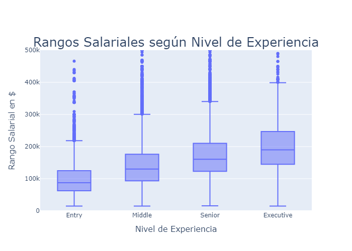
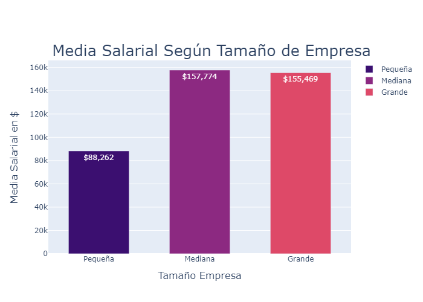
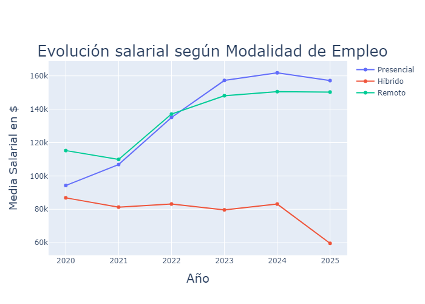
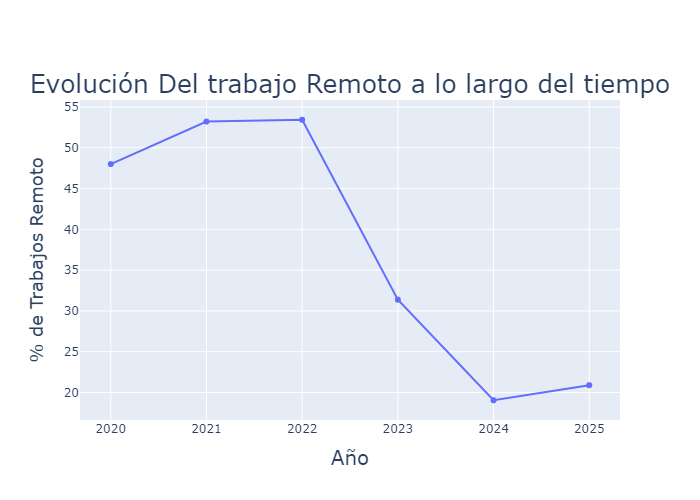
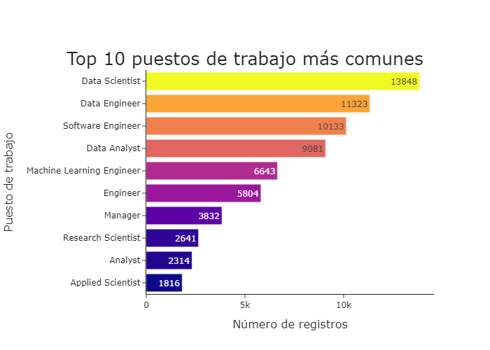
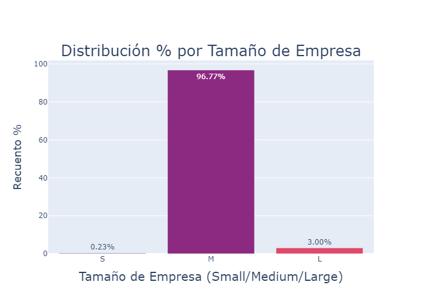

# Análisis Salarial en Ofertas de Empleo

Este proyecto analiza los salarios en diferentes puestos de trabajo según **nivel de experiencia**, **modalidad de empleo** y **tamaño de empresa**, usando el dataset `DataScience_Salaries_2025.csv`.  

El objetivo es extraer insights sobre tendencias salariales, demanda de modalidad remota/presencial y diferencias según experiencia y tamaño de empresa.

---

## Tecnologías utilizadas
- Python
- pandas
- Plotly
- Jupyter Notebook

---

## Gráficos destacados y conclusiones

### 1️⃣ Rangos Salariales según Nivel de Experiencia


**Conclusiones:**
- Los salarios aumentan claramente con el nivel de experiencia.  
- La mediana salarial pasa de aproximadamente \$88,000 (Junior) a \$130,000 (Middle), mostrando un gran incremento.  
- Los salarios de algunos Seniors pueden coincidir con algunos Ejecutivos, pero en general hay claras diferencias por nivel.

---

### 2️⃣ Media Salarial por Tamaño de Empresa


**Conclusiones:**
- Empresas medianas y grandes pagan en rangos similares, con una ligera ventaja para las medianas.  
- Las empresas pequeñas pagan mucho menos, aproximadamente la mitad que medianas y grandes, probablemente por menor presupuesto y clientes más pequeños.

---

### 3️⃣ Evolución Salarial según Modalidad de Empleo


**Conclusiones:**
- La modalidad presencial suele estar ligeramente mejor remunerada que la remota.  
- En general, todas las modalidades muestran un crecimiento de salarios entre 2020 y 2025.  
- La modalidad híbrida tiene menor representación, lo que puede indicar poca demanda o pocos registros en el dataset.

---

### 4️⃣ Evolución del Trabajo Remoto a lo largo del tiempo


**Conclusiones:**
- Descenso en los puestos remotos a partir de 2022, coincidiendo con la finalización de la época COVID.  
- Hay un desplome importante desde 2022 hasta 2024, seguido de un ligero repunte en la tendencia hacia remoto.

---

### 5️⃣ Top 10 Puestos de Trabajo Más Comunes


**Conclusiones:**
- Los puestos más comunes son Data Scientist y Data Engineer, mostrando alta demanda por big data e IA.  
- Software Engineer ocupa el tercer lugar, indicando que siempre habrá necesidad de desarrollo y mantenimiento de software.

---

### 6️⃣ Distribución por Tamaño de Empresa


**Conclusiones:**
- La mayoría de los registros provienen de empresas medianas (~97%).  
- Las empresas grandes comprenden ~3% y las pequeñas ~0.23%.  
- Esto puede deberse a que muchas ofertas provienen de empresas medianas con suficiente capacidad para publicar múltiples vacantes.

---

## Conclusión Global

En general, los análisis muestran que los **salarios en el sector de datos y tecnología** crecen de forma consistente con la **experiencia** y el tiempo. La modalidad **presencial** tiende a estar ligeramente mejor remunerada que la **remota**, aunque esta última ha ganado importancia en los últimos años.

Los **puestos más demandados** siguen siendo **Data Scientist** y **Data Engineer**, seguidos de **Software Engineer**, reflejando la alta necesidad de profesionales en **Big Data**, **Inteligencia Artificial** y desarrollo de software.

Las **empresas medianas** dominan el dataset, lo que indica que son los principales empleadores en este sector, mientras que las **pequeñas** y **grandes** están menos representadas. Esta distribución sugiere que los resultados pueden estar influenciados por la predominancia de las medianas y que los hallazgos sobre pequeñas y grandes empresas deben interpretarse con cautela.

Por último, el análisis muestra que los **salarios se correlacionan positivamente con la experiencia y el nivel de responsabilidad**, y que la **modalidad de trabajo** y el **tamaño de la empresa** son factores relevantes que impactan en la remuneración. Sin embargo, es importante tener en cuenta las **limitaciones del dataset**, como el reducido número de registros en algunos años o modalidades, que pueden afectar la representatividad de ciertos hallazgos.

---

## Cómo reproducir el proyecto

Sigue estos pasos para ejecutar el análisis de salarios y ver todos los gráficos:

1. Clonar el repositorio:  
```bash
git clone https://github.com/Carlos_RdPato/DataScience_Salaries_2025.git
cd DataScience_Salaries_2025
```

2. Instalar dependencias:
```bash
pip install pandas plotly seaborn kaleido
```

3. Abrir el notebook
```bash
jupyter notebook Analisis_Salarios_Ofertas_Empleo.ipynb
```

4. Ejecutar todas las celdas del notebook para generar gráficos y análisis

5. (Opcional) Los gráficos finales también están guardados en la carpeta images/, que puedes abrir directamente sin ejecutar el notebook.
